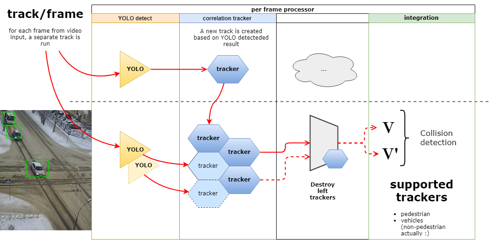

# aihack (CRT problem solving...)

## Data
test.dat Пример аварии.flv
test2.dat Два торопыги.flv

## Idea behind

### Preprocess by YOLO
https://github.com/hoopoe/darknet/commits/master

### Enable dlib Tracker
  
## Projects used
We used several projects, that helped us a lot of 
* dlib - for correlation tracker purpose
* YOLA - for fragmenting cars based on the frame
* darknet/+ that just persist file on the disk

## Algorithm description

